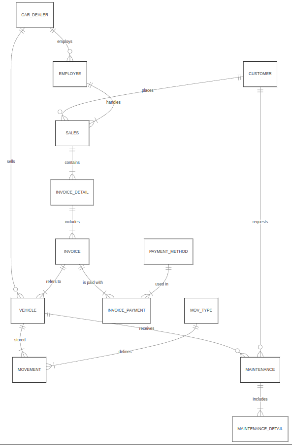
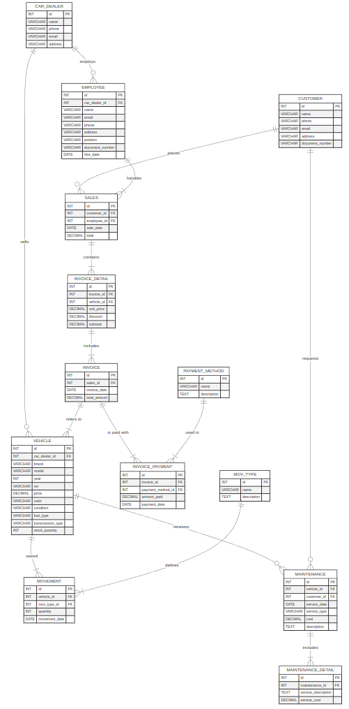
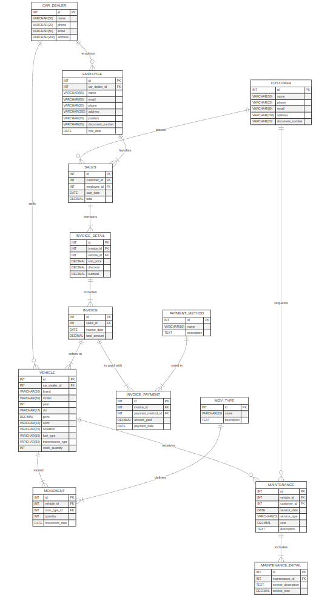

# Concesionario CampusCar

## Descripción

En este proyecto se presenta el diseño de una base de datos para un concesionario de vehículos; en el cual se gestiona la información sobre los vehículos en stock, clientes, ventas, y servicios de mantenimiento, a la vez permite registrar y gestionar vehículos, vendedores, clientes, transacciones de ventas y servicios realizados. 

## Diagrama UML

- **Modelo conceptual:**

- **Modelo lógico:**

- **Modelo físico:**
